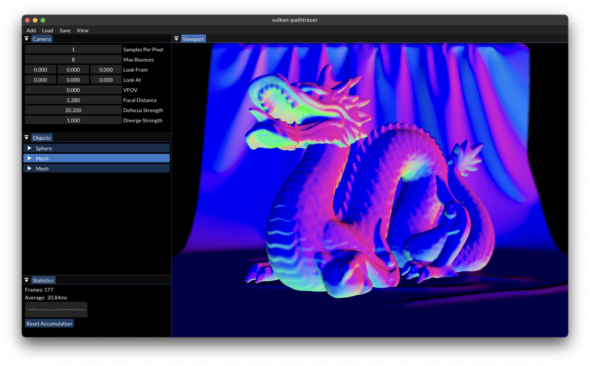
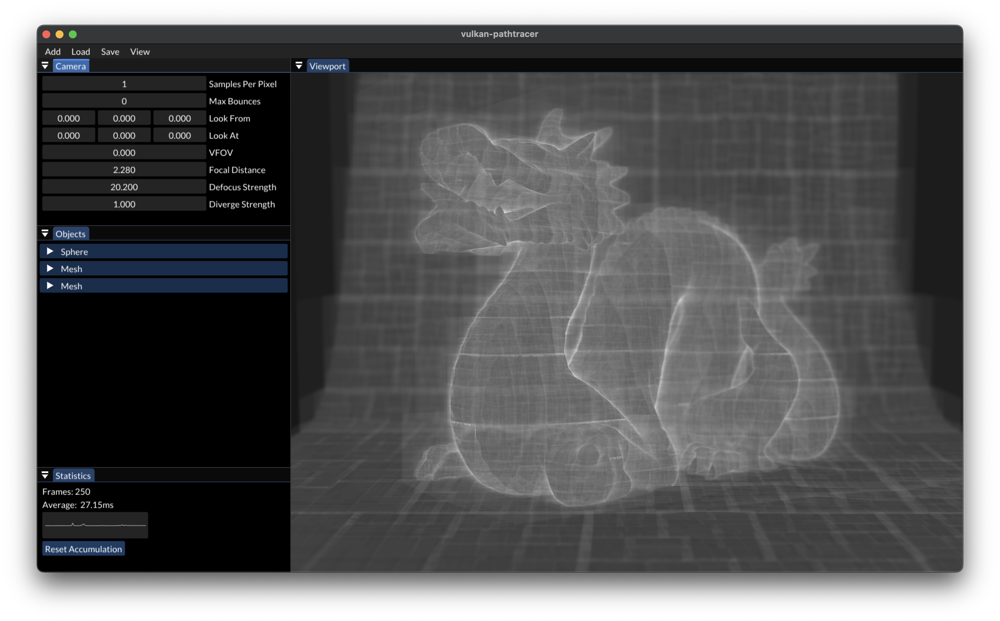

# vk-pathtracer

Interactive, physically-based pathtracing engine using the Vulkan API. Includes full camera control, a custom BVH builder, glTF 2.0 loader, and more. This is a hobby project for my own learning and likely has many naive implementations.


## Table of Contents
- [Requirements](#requirements)
- [Compilation](#compilation)
  - [Mac/Linux](#mac--linux)
  - [Windows](#windows)
- [Features](#features)
- [Roadmap](#roadmap)
- [Issues](#issues)
- [Gallery](#gallery)
- [References](#references)
- [Debug Views](#debug-views)
## Requirements
- Windows, Mac, or Linux
- Vulkan SDK with API v1.2+
- GCC/Clang with C++17
- CMake v3.20+

## Compilation
### Mac & Linux:

```bash
git clone https://github.com/tylertms/vk-pathtracer
cd vk-pathtracer
cmake -B build -DCMAKE_BUILD_TYPE=Release
cmake --build build -j4
./build/bin/vk-pathtracer
```
### Windows:

Install Visual Studio, MinGW, MSYS, or another C++ toolchain.
```bash
git clone https://github.com/tylertms/vk-pathtracer
cd vk-pathtracer
cmake -B build -DCMAKE_BUILD_TYPE=Release
```
If a Makefile generator cannot be found, include the `-G` flag with your corresponding generator, i.e., `MinGW Makefiles` or `MSYS Makefiles`.
```bash
cmake --build build -j4
.\build\bin\vk-pathtracer.exe
```
## Features
- GPU-accelerated pathtracing algorithm
- Fully interactive scene (rotate/zoom/pan)
- Control of camera FOV, focal distance, focal strength, exposure, etc.
- glTF 2.0 loader
- Position objects and adjust material properties from the sidebar
- Mix diffuse, specular, metallic, and dielectric BxDFs
- HDR environment mapping (equirectangular)
- ACES HDR tone mapping
- Partial texture support
- Save and load scenes using YAML files
- And more...

## Roadmap
- Hardware raytracing support (VK_KHR_ray_tracing_pipeline)
- Top level acceleration structure for scenes with many meshes
- Improved glTF texture support and object hierarchy
- BVH optimizations, construction through compute shader
- Wavefront pathtracing (a fundamentally different approach to light transport)
  
## Issues
- Scene saving/loading is currently broken
- Creating new scenes is buggy and will sometimes crash the program
- Textures may not always be detected and may load incorrectly

## Gallery


## References
[Vulkan Tutorial](https://vulkan-tutorial.com) - Alexander Overvoorde

[Ray Tracing in One Weekend](https://raytracing.github.io/books/RayTracingInOneWeekend.html) - Peter Shirley

[Coding Adventure: Ray Tracing](https://www.youtube.com/watch?v=Qz0KTGYJtUk) - Sebastian Lague

[Coding Adventure: Optimizing a Ray Tracer (by building a BVH)](https://www.youtube.com/watch?v=C1H4zIiCOaI) - Sebastian Lague

[Physically Based Rendering: From Theory To Implementation](https://www.pbr-book.org)

[How to build a BVH](https://jacco.ompf2.com/2022/04/13/how-to-build-a-bvh-part-1-basics/) - Jacco Bikker

[RayTracingInVulkan](https://github.com/GPSnoopy/RayTracingInVulkan) - GPSnoopy

## Debug Views
Normal Vector (x/y/z) as Color (r/g/b)

Number of Ray-Box Tests

Number of Ray-Triangle Tests

